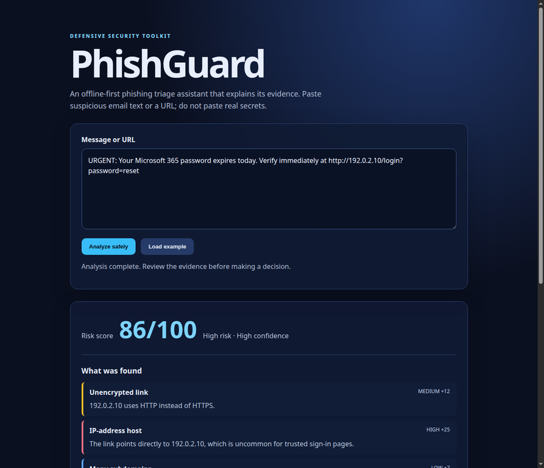

# PhishGuard

I built PhishGuard as an explainable phishing-triage application for analyzing suspicious email text and URLs. It helps a security analyst identify common phishing indicators, understand why a message was flagged, and decide what to investigate next.



## Key features

- Explainable phishing risk score from 0 to 100.
- URL analysis for IP-based hosts, HTTP links, URL shorteners, suspicious TLDs, excessive subdomains, brand impersonation, and sensitive query parameters.
- Message analysis for urgency language, credential requests, payment requests, multiple addresses, and risky attachment references.
- Structured findings with severity, evidence, and score contribution.
- Safe recommendations for analyst follow-up.
- JSON API at `POST /api/analyze`.
- No URL visits, DNS lookups, file downloads, or attachment execution.
- Input validation, request-size limits, output escaping, CSP, and HTTP security headers.

## Tech stack

Python, Flask, REST API, HTML5, CSS3, vanilla JavaScript, pytest, Gunicorn, Docker, Git, GitHub Actions, regular expressions, URL parsing, input validation, threat modeling, and web-security principles.

## How it works

```text
Suspicious email or URL
          |
          v
Flask API validates the request
          |
          v
Python analyzer extracts URLs and checks phishing indicators
          |
          v
Risk score + findings + recommendations
          |
          v
Results displayed in the browser
```

The analyzer uses a transparent additive heuristic model. The score is used for triage and prioritization; it is not a probability and does not replace analyst review.

## Run locally

```bash
git clone https://github.com/Siddiquitaha123/phishguard.git
cd phishguard
python3 -m venv .venv
source .venv/bin/activate
python -m pip install -r requirements.txt
pytest -q
python -m flask --app app.main run
```

Open <http://127.0.0.1:5000>, click **Load example**, and then click **Analyze safely**.

Expected test output:

```text
7 passed
```

### Windows PowerShell

```powershell
py -m venv .venv
.venv\Scripts\Activate.ps1
python -m pip install -r requirements.txt
pytest -q
python -m flask --app app.main run
```

## Run with Docker

```bash
docker build -t phishguard .
docker run --rm -p 5000:5000 phishguard
```

Open <http://127.0.0.1:5000>.

## API usage

```bash
curl -s http://127.0.0.1:5000/api/analyze \
  -H 'Content-Type: application/json' \
  -d '{"text":"URGENT: verify your password at http://192.0.2.10/login?password=x"}'
```

The response includes:

```text
score
verdict
confidence
urls
findings
recommendations
```

## Example result

A message such as:

```text
URGENT: Your Microsoft 365 password expires today.
Verify immediately at http://192.0.2.10/login?password=reset
```

is identified as high risk because it combines an IP-based HTTP URL, urgency language, login wording, and a password request. The IP address is from the documentation-only range reserved for examples.

## Project structure

```text
app/analyzer.py                 Phishing-analysis engine
app/main.py                    Flask routes and security headers
app/templates/index.html       Web interface
app/static/app.js              Browser interactions
app/static/style.css            User interface styling
tests/test_phishguard.py        Unit and API tests
samples/demo_messages.txt      Safe test messages
THREAT_MODEL.md                Security design and mitigations
docs/TEST_RESULTS.md            Verification results
docs/screenshots/               Application screenshot
Dockerfile                      Container configuration
.github/workflows/test.yml     Continuous integration
```

## Security design

PhishGuard treats submitted URLs as untrusted data and never visits them. This reduces the risk of server-side request forgery, malware execution, and accidental data exposure. The application validates input before analysis, escapes displayed findings, avoids storing submitted messages, and adds browser security headers including Content Security Policy, clickjacking protection, MIME-sniffing protection, and a restrictive permissions policy.

## Testing

The automated test suite covers:

- URL extraction and normalization
- High-risk phishing detection
- Low-risk messages
- Invalid content types
- Empty input
- Oversized input
- JSON API responses
- Security headers

Full verification details are available in [docs/TEST_RESULTS.md](docs/TEST_RESULTS.md).

## Future improvements

- Email header analysis for SPF, DKIM, and DMARC results
- SQLite-based case tracking
- Analyst feedback and decision history
- Threat-intelligence enrichment through an isolated worker
- Precision, recall, and false-positive evaluation on a privacy-safe dataset
- SIEM event export for security monitoring

## License

MIT License. See [LICENSE](LICENSE).
